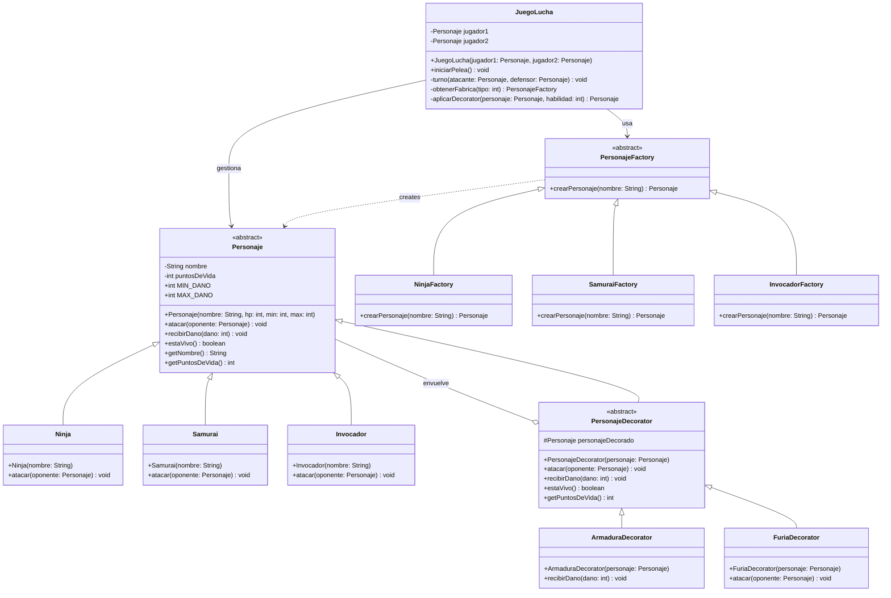

# JuegoLucha-POO
juego de lucha en Java implementando patrones de diseño Factory Method y Decorator

# Juego de Lucha - Patrones de Diseño

Juego de lucha por turnos desarrollado en Java, implementando los patrones de diseño **Factory Method** (creacional) y **Decorator** (estructural).

## Descripcion

Dos jugadores eligen un personaje y una habilidad especial. Luego se enfrentan en una batalla por turnos hasta que uno quede sin puntos de vida.

## Patrones de Diseño Implementados

### Factory Method
Permite crear distintos tipos de personajes (Ninja, Samurai, Invocador) sin instanciarlos directamente en la clase JuegoLucha. Cada fabrica concreta decide que objeto crear.

### Decorator
Permite agregar habilidades especiales a un personaje en tiempo de ejecucion sin modificar su clase base:
- **Armadura:** reduce el dano recibido en un 20%
- **Furia:** aumenta el dano causado en un 20%

## Personajes

| Personaje | HP | Dano minimo | Dano maximo |
|---|---|---|---|
| Ninja | 80 | 15 | 35 |
| Samurai | 120 | 10 | 25 |
| Invocador | 70 | 20 | 40 |

## Como ejecutar

```bash
javac JuegoLucha.java
java JuegoLucha
```

## Estructura del proyecto

- `Personaje` - Clase base abstracta
- `Ninja`, `Samurai`, `Invocador` - Subclases (herencia)
- `PersonajeFactory` - Fabrica abstracta
- `NinjaFactory`, `SamuraiFactory`, `InvocadorFactory` - Fabricas concretas
- `PersonajeDecorator` - Decorator base abstracto
- `ArmaduraDecorator`, `FuriaDecorator` - Decorators concretos
- `JuegoLucha` - Clase principal con el metodo main

## Diagrama de Clases



## Autores
Desarrollado como actividad academica para la materia de Programacion Orientada a Objetos.

- Cristhian Garces
- Jhojan Carabali
- Juan Pablo Vasquez
