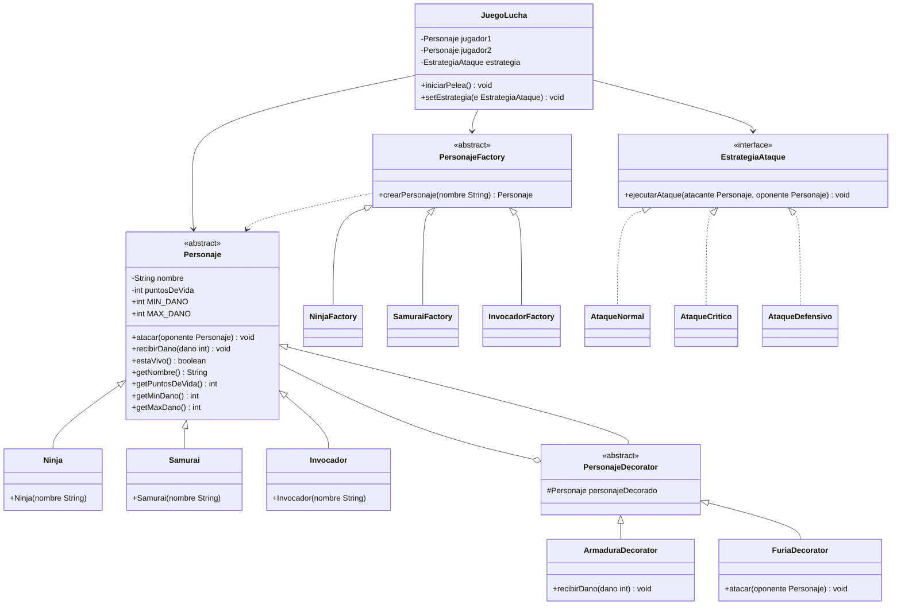

# Juego de Lucha - Patrones de Diseño y Pruebas


Juego de lucha por turnos desarrollado en Java, aplicando patrones de diseño creacionales y estructurales, pruebas unitarias con JUnit 5 y Mockito, y pipeline de integración continua con GitHub Actions.

## Integrantes
- Cristhian Garces
- Jhojan Carabali
- Juan Pablo Vasquez

## Patrones de Diseño Implementados

### Factory Method (Creacional)
Permite crear distintos tipos de personajes sin instanciarlos directamente. Cada fábrica concreta decide qué objeto crear.
- `NinjaFactory` → crea un `Ninja`
- `SamuraiFactory` → crea un `Samurai`
- `InvocadorFactory` → crea un `Invocador`

### Decorator (Estructural)
Agrega habilidades especiales a un personaje en tiempo de ejecución sin modificar su clase base.
- `ArmaduraDecorator`: reduce el daño recibido en un 20%
- `FuriaDecorator`: aumenta el daño causado en un 20%

### Strategy (Estructural)
Permite cambiar el comportamiento de ataque en tiempo de ejecución.
- `AtaqueNormal`: daño estándar según el personaje
- `AtaqueCritico`: daño aumentado un 50%
- `AtaqueDefensivo`: daño reducido un 50%

## Personajes

| Personaje  | HP  | Daño mínimo | Daño máximo |
|------------|-----|-------------|-------------|
| Ninja      | 80  | 15          | 35          |
| Samurai    | 120 | 10          | 25          |
| Invocador  | 70  | 20          | 40          |

## Estructura del Proyecto

```
src/
├── main/java/com/juego/
│   ├── model/
│   │   ├── Personaje.java
│   │   ├── Ninja.java
│   │   ├── Samurai.java
│   │   └── Invocador.java
│   ├── patrones/
│   │   ├── factory/
│   │   ├── decorator/
│   │   └── strategy/
│   └── juego/
│       └── JuegoLucha.java
└── test/java/com/juego/
    ├── model/
    ├── patrones/
    └── juego/
```
## Pruebas Unitarias

Se implementaron 27 pruebas unitarias usando JUnit 5 y Mockito con cobertura superior al 80%.

| Clase de prueba   | Tests | Resultado |
|-------------------|-------|-----------|
| PersonajeTest     | 10    | ✅ Pasando |
| PatronesTest      | 10    | ✅ Pasando |
| JuegoLuchaTest    | 7     | ✅ Pasando |
| **Total**         | **27**| ✅ **Todos pasando** |

## Integración Continua

El proyecto usa GitHub Actions para ejecutar automáticamente en cada push:
1. Compilación con Maven
2. Ejecución de pruebas
3. Generación de reporte de cobertura JaCoCo

## Cómo ejecutar

```bash
# Compilar
mvn clean compile

# Ejecutar pruebas
mvn test

# Generar reporte de cobertura
mvn jacoco:report
```

## Diagrama de Clases


```mermaid
classDiagram
    direction TB

    class Personaje {
        <<abstract>>
        -String nombre
        -int puntosDeVida
        +int MIN_DANO
        +int MAX_DANO
        +atacar(oponente Personaje) void
        +recibirDano(dano int) void
        +estaVivo() boolean
        +getNombre() String
        +getPuntosDeVida() int
        +getMinDano() int
        +getMaxDano() int
    }

    class Ninja { +Ninja(nombre String) }
    class Samurai { +Samurai(nombre String) }
    class Invocador { +Invocador(nombre String) }

    class PersonajeDecorator {
        <<abstract>>
        #Personaje personajeDecorado
    }

    class ArmaduraDecorator { +recibirDano(dano int) void }
    class FuriaDecorator { +atacar(oponente Personaje) void }

    class PersonajeFactory {
        <<abstract>>
        +crearPersonaje(nombre String) Personaje
    }

    class NinjaFactory
    class SamuraiFactory
    class InvocadorFactory

    class EstrategiaAtaque {
        <<interface>>
        +ejecutarAtaque(atacante Personaje, oponente Personaje) void
    }

    class AtaqueNormal
    class AtaqueCritico
    class AtaqueDefensivo

    class JuegoLucha {
        -Personaje jugador1
        -Personaje jugador2
        -EstrategiaAtaque estrategia
        +iniciarPelea() void
        +setEstrategia(e EstrategiaAtaque) void
    }

    Personaje <|-- Ninja
    Personaje <|-- Samurai
    Personaje <|-- Invocador
    Personaje <|-- PersonajeDecorator
    PersonajeDecorator <|-- ArmaduraDecorator
    PersonajeDecorator <|-- FuriaDecorator
    PersonajeDecorator o-- Personaje
    PersonajeFactory <|-- NinjaFactory
    PersonajeFactory <|-- SamuraiFactory
    PersonajeFactory <|-- InvocadorFactory
    PersonajeFactory ..> Personaje
    EstrategiaAtaque <|.. AtaqueNormal
    EstrategiaAtaque <|.. AtaqueCritico
    EstrategiaAtaque <|.. AtaqueDefensivo
    JuegoLucha --> Personaje
    JuegoLucha --> EstrategiaAtaque
    JuegoLucha --> PersonajeFactory
```
